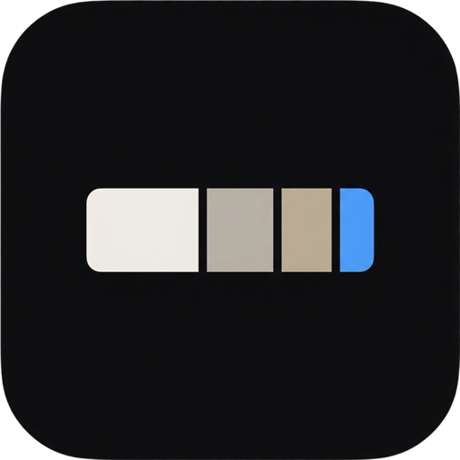

<div align="center">



# MacSift

**A transparent disk cleaner for macOS Tahoe.**

See exactly what's taking up space, group it by the app that owns it,
and move everything to the Trash — never permanent deletion.

**[Website](https://lcharvol.github.io/MacSift/) · [Download latest](https://github.com/Lcharvol/MacSift/releases/latest/download/MacSift.zip) · [Release notes](https://github.com/Lcharvol/MacSift/releases/latest)**

</div>

---

## Why another disk cleaner?

Commercial Mac cleaners all have the same problem: you press a big button
and they "clean" a few gigabytes you never see. You trust them by default.
If anything important disappears, it's already gone.

MacSift is the opposite:

- Everything you're about to delete is listed, grouped, and labeled.
- Selected items go to the **Trash**, not `rm -rf`. Finder restores anything
  until you empty it.
- **Dry run is on by default** for first-time users.
- Destructive actions require an explicit confirmation; deletions above 10&nbsp;GB
  show an extra warning.
- Zero network calls. Zero telemetry. 100 tests, all green.
- Every scan completion and cleanup run is written to
  `~/Library/Logs/MacSift/macsift.log` so you can audit what the app did
  without a debugger.

## Install

### Option A — Homebrew (one command)

```bash
brew tap Lcharvol/macsift
brew install --cask macsift
```

The tap lives at [Lcharvol/homebrew-macsift](https://github.com/Lcharvol/homebrew-macsift).
Since MacSift isn't notarized yet, the cask's `postflight` strips the
`com.apple.quarantine` attribute automatically — you can double-click
the installed `MacSift.app` without the right-click → Open dance.

Upgrade later with `brew upgrade --cask macsift`. Uninstall with
`brew uninstall --cask --zap macsift` to also remove settings and logs.

### Option B — Download the release

1. Download [**MacSift.zip**](https://github.com/Lcharvol/MacSift/releases/latest/download/MacSift.zip) (1.5&nbsp;MB, Apple Silicon).
2. Unzip and **drag `MacSift.app` into `/Applications`** before opening it.
   Gatekeeper treats apps inside `~/Downloads` more strictly, so moving it
   first avoids an extra warning.
3. **First launch:** right-click (or Control-click) `MacSift.app` in
   `/Applications` → **Open** → confirm the second dialog.

   On macOS Sequoia (15) and later, the right-click trick no longer
   bypasses Gatekeeper on its own. If you see *"Apple could not verify
   'MacSift.app' is free of malware"*, open **System Settings → Privacy
   &amp; Security**, scroll to the bottom, and click **Open Anyway**
   next to the MacSift entry. Relaunch the app — you'll be prompted
   once more, then every subsequent launch is silent.

   Gatekeeper asks because the app is ad-hoc signed, not notarized
   (no paid Apple Developer account). Building from source (Option B)
   is the workaround if you'd rather not go through this.
4. Grant **Full Disk Access** in System Settings → Privacy &amp; Security →
   Full Disk Access.

### Option C — Build from source

Same binary, verified from the source tree.

```bash
git clone https://github.com/Lcharvol/MacSift.git
cd MacSift
./build-app.sh && open MacSift.app
```

The build script produces a signed `.app` bundle in one step. macOS 26
(Tahoe), Apple Silicon, and the Xcode 26 command-line tools are required.

## What it does

- **Scans** `~/Library/Caches`, `~/Library/Logs`, `~/Library/Application Support`,
  `/tmp`, `/private/var/log`, and your entire home directory for large files.
- **Detects** Time Machine local snapshots and iOS device backups (device
  name + date read from `Info.plist`).
- **Classifies** every file into one of eleven categories:
  Caches · Logs · Temporary Files · Unused App Data · Large Files ·
  Time Machine Snapshots · iOS Backups · **Xcode Junk** · **Dev Caches** ·
  **Old Downloads** · **Mail Attachments**.
- **Groups** by owning app. `~/Library/Caches/com.apple.Safari/*` — 15,000
  files — shows up as a single **Safari** row. One decision, not fifteen thousand.
- **Orphan detection** — `Application Support` folders are only flagged as
  `.appData` if their owning app is no longer installed in `/Applications`.
- **Inspector panel** with Reveal in Finder, Quick Look, Copy Path, and
  a live preview of the top 5 largest files in any selected group.
- **Moves to Trash** via `FileManager.trashItem`. Never a permanent delete.

## Keyboard shortcuts

| Shortcut | Action |
|----------|--------|
| `⌘R` | Start / restart scan |
| `⌘.` | Cancel scan |
| `⌘A` | Select all safe items |
| `⌘⇧A` | Deselect all |
| `Esc` | Dismiss cleaning preview |

Drop any folder on the window to scan just that folder.

## Safety at the engine level

- `/System`, `/usr`, `/bin`, `/sbin` are **hard-blocked** in `CleaningEngine`
  before any delete call — not just hidden in the UI.
- Application Support folders that belong to still-installed apps are
  never surfaced.
- Dry run is **on** by default for new installs (`AppState.init` seeds it
  to `true`).
- The cleaning flow can't be triggered without passing through
  `CleaningPreviewView` and an explicit confirmation alert.
- Selection is stored as a `Set<String>` of SHA-256 file-id hashes so that
  a re-scan preserves your selection of files that still exist — and drops
  selections whose files are gone.

If you'd rather verify than trust, the engine is ~120 lines:
[`MacSift/Services/CleaningEngine.swift`](MacSift/Services/CleaningEngine.swift).

## Architecture

Strict MVVM. Pure SwiftPM project — no `.xcodeproj`, no Xcode GUI needed.

```
MacSift/
├── App/          # MacSiftApp @main, AppState
├── Models/       # FileCategory, ScannedFile, ScanResult, FileGroup — all Sendable value types
├── Services/     # DiskScanner, CategoryClassifier, FileGrouper, CleaningEngine,
│                   TimeMachineService, ExclusionManager
├── ViewModels/   # ScanViewModel, CleaningViewModel — @MainActor, @Published
├── Views/        # SwiftUI views. Prefer plain values over VM observation.
└── Utilities/    # FileSize+Formatting, FileDescriptions, BundleNames, Permissions
```

The detailed conventions, performance rules, and debugging lessons are in
[`CLAUDE.md`](CLAUDE.md) — read that before touching the file list or the
scanner.

## Development

```bash
swift build                              # type-check
swift test                               # 100 tests across 16 suites
swift test --filter FileGrouper          # run one suite
./build-app.sh                           # build the .app bundle
./build-app.sh release                   # release-optimized build
```

GitHub Actions runs `swift test` on every push to `main` (see
[`.github/workflows/test.yml`](.github/workflows/test.yml)).

## Known limitations

- **Apple Silicon only.** No Intel build in the current release.
- **Gatekeeper asks once on first launch** because the app is ad-hoc signed
  rather than notarized — distributing a notarized binary requires a paid
  Apple Developer account. Building from source (Option B) is the workaround
  if you'd rather not trust a pre-built binary.
- **Dock icon** renders slightly smaller than first-party Tahoe apps because
  legacy `.icns` icons aren't the new Icon Composer asset format.
- **Time Machine snapshot deletion** can require admin privileges. If
  `tmutil deletelocalsnapshots` fails, the cleaning report shows the exact
  `sudo` command to run in Terminal.

## Uninstall

Easiest way: open **Settings → Uninstall MacSift…** inside the app.
That single button:

- erases every MacSift preference (mode, dry-run, threshold, exclusions,
  lifetime counters)
- deletes the audit log at `~/Library/Logs/MacSift`
- removes any `MacSift-<version>.zip` cached update zips and their
  extracted folders from `~/Downloads`
- moves `MacSift.app` itself to the Trash
- quits the app

The one thing MacSift can't undo for you is the **Full Disk Access
grant** — that's managed by macOS's TCC and only you can revoke it, in
System Settings → Privacy & Security → Full Disk Access.

If you'd rather do it by hand from Terminal:

```bash
# Quit the app, then:
rm -rf /Applications/MacSift.app

# Clean up persisted preferences + exclusion list
defaults delete com.macsift.app

# Optional: remove the local audit log
rm -rf ~/Library/Logs/MacSift

# Optional: remove any downloaded update zips
rm -f ~/Downloads/MacSift-*.zip
rm -rf ~/Downloads/MacSift-*
```

MacSift writes to exactly three places on disk — its UserDefaults
domain, `~/Library/Logs/MacSift/macsift.log` (capped at ~500 KB), and
update zips in `~/Downloads`. No keychain entries, no LaunchAgents, no
`~/Library/Application Support/MacSift` folder. Nothing else to clean.

## License

MIT. See [`LICENSE`](LICENSE). Fork it, learn from it, ship your own
version — just keep the copyright notice. The cleaning engine in
particular is worth reading even if you don't plan to use the app.
